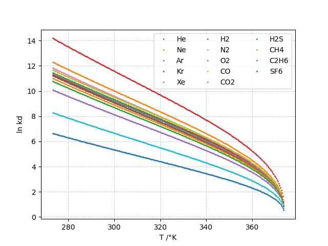

[TOC]

# Introduction

The API defines convenient functions and subroutines for computing water physico-chemical properties. 

# Value at the critical point

Critical values are available as constants:

 * water:
    * [[iapws__r283(module):Tc_H2O]]
    * [[iapws__r283(module):rhoc_H2O]]
    * [[iapws__r283(module):pc_H2O]]

 * In heavywater
    * [[iapws__r283(module):Tc_D2O]]
    * [[iapws__r283(module):rhoc_D2O]]
    * [[iapws__r283(module):pc_D2O]]

See [R2-83](../references.html) for more details.

# Henry's Constant and Vapor-Liquid Distribution Constant for Gases in H2O and D2O

The Henry constant [[iapws__g704(module):kh(subroutine)]] and 
the liquid-vapor distribution constant [[iapws__g704(module):kd(subroutine)]] 
can be computed for the following gases as defined in :

 * in water: He, Ne, Ar, Kr, Xe, H2, N2, O2, CO, CO2, H2S, CH4, C2H6, SF6
 * in heavywater: He, Ne, Ar, Kr, Xe, D2, CH4

The available gases can be retrieved with

 * [[iapws__g704(module):gases(function)]] which returns the available gases as a list.
 * [[iapws__g704(module):gases2(function)]] which return the available gases as a string.
 * [[iapws__g704(module):ngases(function)]] which returns the number of available gases.

See [G7-04](../references.html) for more details.

# Thermodynamic Properties of Water and Steam

Five regions which cover the following range of validity:

 * \(273.15K < T < 1073.15K\) and \(p < 100MPa\) 
 * \(1073.15K < T < 2273.15K\) and  \(p < 50MPa\)

The saturation-pressure [[iapws__api(module):psat(subroutine)]] and the 
saturation-temperature [[iapws__api(module):Tsat(subroutine)]] computes the 
saturation line as shown in the plot below.

See [R7-97](../references.html) for more details.

