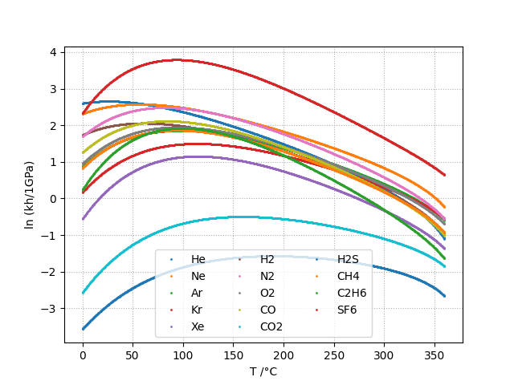
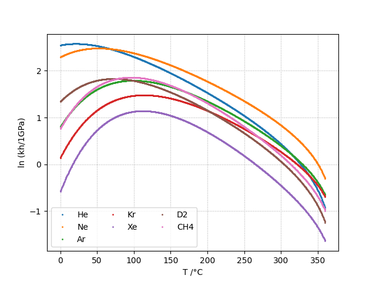
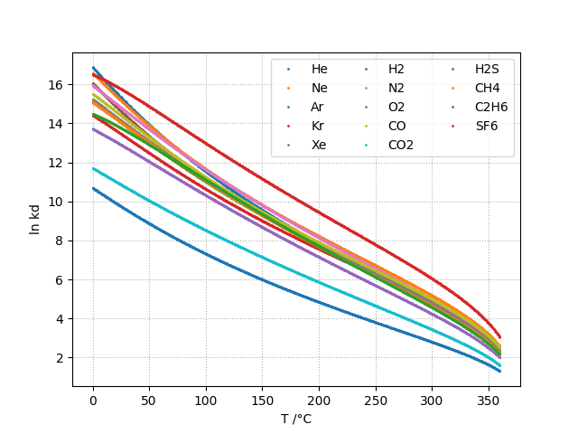
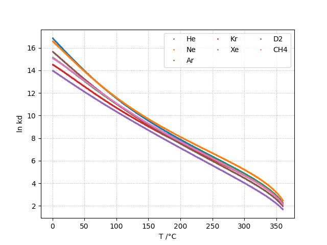

# Description

The computation is based on the parameters provided by the technical report [G7-04](../references.html)

# Henry Contant: kh

The Henry constant \(kH\) is defined as shown in equation below.
\(k_H\) is expressed in MPa.

$$ k_H = \lim_{x_2 \rightarrow 0} f_2/x_2 $$
 
* \(f_2\): liquid-phase fugacity
* \(x_2\): mole fraction of the solute
 
The Henry's constant \(k_H\) is given as a function of temperature by:

$$  \ln \left( \frac{k_H}{p_1^*} \right) = A/T_R + \frac{B \cdot \tau^{0.355}}{T_R} + C \cdot T_R^{-0.41} \cdot \exp \tau $$

* \(\tau = 1-T_R\)
* \(T_R = T/T_{c1}\)
* \(T_{c1}\): critical temperature of the solvent as recommended by IAPWS :cite:p:\)iapws2007\)
* \(p_1^{*}\) is the vapor pressure of the solvent at the temperature of interest and 
  is calculated from the correlation of [Wagner and Pruss for \(H_2O\)](../references.html) 
  and from the correlation of [Harvey and Lemmon  for \(D_2O\)](../references).

Both equations have the form: 

$$ \ln \left( p_1^{*}/p_{c1} \right) = T_R^{-1} \sum_{i=1}^{n}a_i \tau^{b_i} $$

* \(n\) is 6 for  \(H_2O\) and 5 for \(D_2O\)
* \(p_{c1}\) is the critical pressure of the solvent recommended by the report [R2-83](../references.html) 

# Vapor-Liquid Distribution Constant: kd

The liquid-vapor distribution constant \(kD\) is defined as shown in equation below.
\(K_D\) is adimensional.

$$    k_D = \lim_{x_2 \rightarrow 0} y_2/x_2 $$

* \(x_2\): mole fraction of the solute
* \(y_2\) is the vapor-phase solute mole fraction in equilibrium with the liquid

The vapor-liquid distribution constant \(k_D\) is given as a function of temperature by:

$$    \ln K_D =qF+ \frac{E}{T(K)}f(\tau)+(F+G\tau^{2/3} +H\tau) \exp \left( \frac{273.15 - T(K)}{100} \right) $$

* \(q\) : -0.023767 for \(H_2O\) and -0.024552 for \(D_2O\).
* \(f(\tau)\) [Wagner et al. for \(H_2O\)](../references)  and [fernandez-prini et al. for \(D_2O\)](../references.html)

In both cases, \(f(\tau)\) has the following form:
    
$$ f(\tau) = \sum _{i=1} ^{n} c_i \cdot \tau ^{d_i} $$

* \(n\) is 6 for \(H_2O\) and 4 for \(D_2O\) 

# Molar fractions

The molar fractions \(x_2\) and \(y_2\) as following: 

$$    x_2 = \frac{f_2}{k_H} $$
$$ \frac{x_2}{f_2} = \frac{1}{k_H} $$
$$ y_2 = \frac{k_D}{k_H} \cdot f_2 $$
$$ \frac{y_2}{f_2} = \frac{k_D}{k_H} $$

By fixing \(f_2\) at 1.0 it comes that the molar fractions 
\(x_2\) and \(y_2\) are then expressed per 
unit of pressure as shown in the following equation .

$$ x_2 = \frac{1}{k_H} $$
$$ y_2 = \frac{k_D}{k_H} $$

The molar fractions can be converted to solubilties in ppm or cm3/kg by considering dilute solutions. 
\(X\) is the considered gas and the solvent is either \(H_2O\) or \(D_2O\).

$$ S_{X}[mg.kg^{-1}.bar^{-1}] = x_2[bar^{-1}] \cdot \frac{M_{X}[g.mol^{-1}]}{M_{solvent}[g.mol^{-1}]} \cdot 10^6 $$    
$$ S_{X}[cm3.kg^{-1}.bar^{-1}] = \frac{S_{X}[mg.kg^{-1}.bar^{-1}]}{M_{X}[g.mol^{-1}]} \cdot V_m[mol.L^{-1}] $$
    
# Available gases

\(kh\) and \(kd\) can be computed for the following gases:

* in water: He, Ne, Ar, Kr, Xe, H2, N2, O2, CO, CO2, H2S, CH4, C2H6, SF6
* in heavywater: He, Ne, Ar, Kr, Xe, D2, CH4

# Plots

