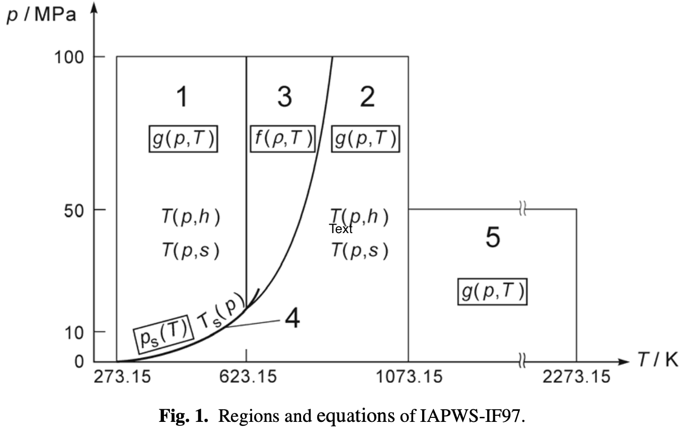

# Description

The computation is based on the parameters provided by the technical report [R7-97](../references.html).

# Structure of the formulation

The R7-97 report consists of a set of equations for different 
regions which cover the following range of validity:

* \(273.15K < T < 1073.15K\) and \(p < 100MPa\) 
* \(1073.15K < T < 2273.15K\) and  \(p < 50MPa\)

   

# Reference constants

The specific gas constant of ordinary water used for this formulation is

* \(R = 0.461 526\ kJ.kg^{-1}.K^{-1}\)

This value results from the recommended values of the molar gas constant, 
and the molar mass of ordinary water ([Wagner et al., Harvey et al.](../references.html)).
The values of the critical parameters

* \(T_c = 647.096 K\)
* \(p_c = 22.064 MPa\)
* \(\rho _c = 322 kg.m^{-3} \)

are from the corresponding IAPWS release.

# Auxiliary Equation for the Boundary between Regions 2 and 3

$$ \pi = n_1 + n_2 \theta + n_3 \theta ^2 $$

$$ \theta = n_4 + \left( \frac{\pi - n_5}{n_3} \right)^{1/2} $$
