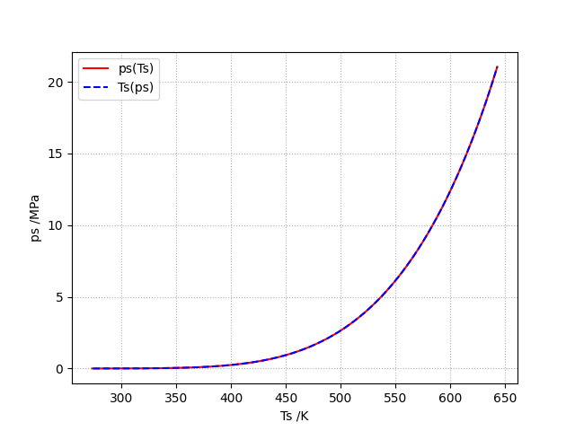

#####################
IAPWS - Documentation
#####################

.. image:: ../../../media/logo.png
  :width: 400
  :align: center
  :alt: Alternative text

Light and heavy water properties according to IAPWS.

.. only:: html
    
    - man page: :download:`iapws.3 <../build/man/iapws.3>`.
    
    - info: :download:`iapws.info <../build/texinfo/iapws.info>`.
    
    - pdf: :download:`iapws.pdf <../build/latex/iapws.pdf>`.

Critical values are available as constants :cite:p:`iapws1992-1`:

* water:
   * `Tc_H2O`
   * `rhoc_H2O`
   * `pc_H2O`

* In heavywater
   * `Tc_D2O`
   * `rhoc_D2O`
   * `pc_D2O`

The Henry constant `kh` and 
the liquid-vapor distribution constant `kd` 
can be computed for the following gases as defined in :cite:p:`iapws2004-1` :

* in water: He, Ne, Ar, Kr, Xe, H2, N2, O2, CO, CO2, H2S, CH4, C2H6, SF6
* in heavywater: He, Ne, Ar, Kr, Xe, D2, CH4

The available gases can be retrieved with

* `gases` which returns the available gases as a list.
* `gases2` which return the available gases as a string.
* `ngases` which returns the number of available gases.

.. figure:: ../../../media/g704-kh_H2O.png 
   :width: 400px

   :math:`k_H` in :math:`H_2O`

.. figure:: ../../../media/g704-kh_D2O.png 
   :width: 400px

   :math:`k_H` in :math:`D_2O`

.. figure:: ../../../media/g704-kd_H2O.png 
   :width: 400px

   :math:`k_D` in :math:`H_2O`

.. figure:: ../../../media/g704-kh_D2O.png 
   :width: 400px

   :math:`k_D` in :math:`D_2O`

Five regions which cover the following range of validity :cite:p:`iapws2012-1`:

* :math:`273.15K < T < 1073.15K` and :math:`p < 100MPa`
* :math:`1073.15K < T < 2273.15K` and  :math:`p < 50MPa`

.. figure:: ../../../media/iapws_r797-regions.png
   :width: 400px

   Water regions defined in R7-97

The saturation-pressure `psat` and the 
saturation-temperature `Tsat` computes the 
saturation line as shown in the plot below.

   Saturation line.

.. toctree::
   :maxdepth: 1
   :hidden:
   
   getting_started/index.rst
   examples/index.rst
   api/index.rst
   changelog/index.rst
   references/index.rst
