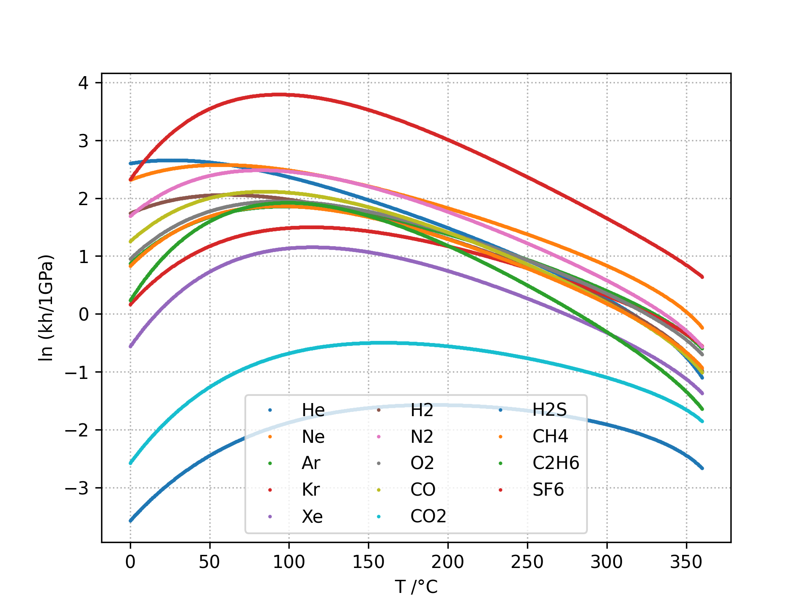
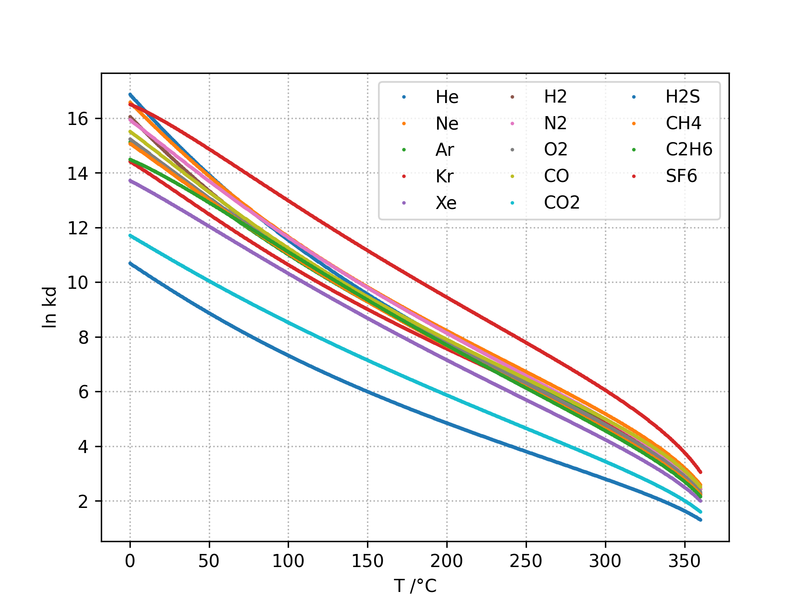
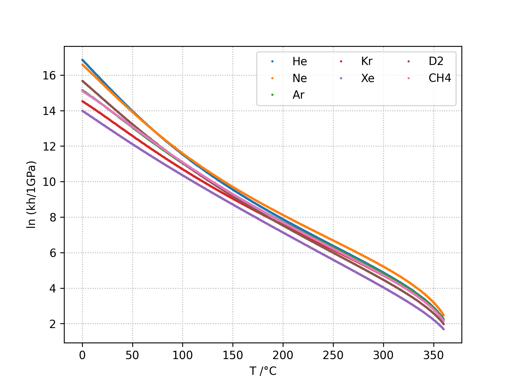

IAPWS G7-04
==================

The computation is based on the parameters provided by the IAPWS 2004 :cite:p:`iapws2004`.

Henry Contant: kh
^^^^^^^^^^^^^^^^^^^^
The Henry constant :math:`kH` is defined as shown in equation :eq:`eq_iapws_kH`.
:math:`k_H` is expressed in MPa.

.. math::
    :label: eq_iapws_kH

    k_H = \lim_{x_2 \rightarrow 0} f_2/x_2 
 
* :math:`f_2`: liquid-phase fugacity
* :math:`x_2`: mole fraction of the solute
 
The Henry's constant :math:`k_H` is given as a function of temperature by:

.. math::
    :label: eq_iapws_lnkH

    \ln \left( \frac{k_H}{p_1^*} \right) = A/T_R + \frac{B \cdot \tau^{0.355}}{T_R} + C \cdot T_R^{-0.41} \cdot \exp \tau

* :math:`\tau = 1-T_R`
* :math:`T_R = T/T_{c1}`
* :math:`T_{c1}`: critical temperature of the solvent as recommended by IAPWS :cite:p:`iapws2007`
* :math:`p_1^*` is the vapor pressure of the solvent at the temperature of interest and 
  is calculated from the correlation of Wagner and Pruss for :math:`H_2O` :cite:p:`wagner1993` 
  and from the correlation of Harvey and Lemmon  for :math:`D_2O` :cite:p:`harvey2002`.

Both equations have the form: 

.. math::
    :label: eq_iapws_pstar
    
    \ln \left( p_1^{*}/p_{c1} \right) = T_R^{-1} \sum_{i=1}^{n}a_i \tau^{b_i}

* :math:`n` is 6 for  :math:`H_2O` and 5 for :math:`D_2O`
* :math:`p_{c1}` is the critical pressure of the solvent recommended by IAPWS :cite:p:`iapws2007`

Vapor-Liquid Distribution Constant: kd
^^^^^^^^^^^^^^^^^^^^^^^^^^^^^^^^^^^^^^^^^

The liquid-vapor distribution constant :math:`kD` is defined as shown in equation :eq:`eq_iapws_kD`.
:math:`K_D` is adimensional.

.. math::
    :label: eq_iapws_kD

    k_D = \lim_{x_2 \rightarrow 0} y_2/x_2 

* :math:`x_2`: mole fraction of the solute
* :math:`y_2` is the vapor-phase solute mole fraction in equilibrium with the liquid

The vapor-liquid distribution constant `k_D` is given as a function of temperature by:

.. math:: 
    :label: eq_iapws_lnkD

    \ln K_D =qF+ \frac{E}{T(K)}f(\tau)+(F+G\tau^{2/3} +H\tau) \exp \left( \frac{273.15 - T(K)}{100} \right)

* :math:`q` : -0.023767 for :math:`H_2O` and -0.024552 for :math:`D_2O`.
* :math:`f(\tau)` :cite:p:`wagner1993` for :math:`H_2O`  and :cite:p:`fernandez-prini2003` for :math:`D_2O`.

In both cases, :math:`f(\tau)` has the following form:
    
.. math::
    :label: eq_iapws_ftau
    
    f(\tau) = \sum _{i=1} ^{n} c_i \cdot \tau ^{d_i}

* :math:`n` is 6 for :math:`H_2O` and 4 for :math:`D_2O` 

Molar fractions
^^^^^^^^^^^^^^^^^

The molar fractions :math:`x_2` and :math:`y_2` can be expressed from the 
equations :eq:`eq_iapws_kH` and :eq:`eq_iapws_kD` as shown in :eq:`eq_iapws_molar_frac`. 

.. math::
    :label: eq_iapws_molar_frac

    x_2 = \frac{f_2}{k_H}\\
    \frac{x_2}{f_2} = \frac{1}{k_H}\\
    y_2 = \frac{k_D}{k_H} \cdot f_2 \\
    \frac{y_2}{f_2} = \frac{k_D}{k_H}

By fixing :math:`f_2` at 1.0 it comes that the molar fractions 
:math:`x_2` and :math:`y_2` are then expressed per 
unit of pressure as shown in equation :eq:`eq_iapws_molar_frac_simple` .

.. math::
    :label: eq_iapws_molar_frac_simple
    
    x_2 = \frac{1}{k_H}\\
    y_2 = \frac{k_D}{k_H}

The molar fractions can be converted to solubilties in ppm or cm3/kg as shown in equation :eq:`eq_conversion`
by considering dilute solutions. :math:`X` is the considered gas and the solvent is either :math:`H_2O`
or :math:`D_2O`.

.. math:: 
    :label: eq_conversion

    S_{X}[mg.kg^{-1}.bar^{-1}] = x_2[bar^{-1}] \cdot \frac{M_{X}[g.mol^{-1}]}{M_{solvent}[g.mol^{-1}]} \cdot 10^6
    
    S_{X}[cm3.kg^{-1}.bar^{-1}] = \frac{S_{X}[mg.kg^{-1}.bar^{-1}]}{M_{X}[g.mol^{-1}]} \cdot V_m[mol.L^{-1}]
    
Available gases
------------------

:math:`kh` and :math:`kd` can be computed for the following gases:

* in water: He, Ne, Ar, Kr, Xe, H2, N2, O2, CO, CO2, H2S, CH4, C2H6, SF6
* in heavywater: He, Ne, Ar, Kr, Xe, D2, CH4

Plots
----------

.. _fig_kh_H2O:

    kh in H2O

.. _fig_kh_D2O:
.. figure:: ../media/g704_kh_D2O.png
    :width: 600
    :align: center
    :alt: kh in D2O

    kh in D2O

.. _fig_kd_H2O:

    kh in H2O

.. _fig_kd_D2O:

    kd in D2O